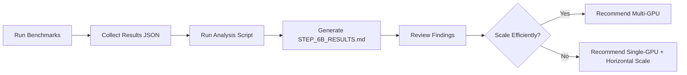

# Step 6B Multi-GPU Setup - Quick Reference

**Status:** ✅ Ready to Deploy  
**Created:** February 15, 2026

---

## 📦 What's Been Prepared

### 1. Documentation
- ✅ [STEP_6B_CHECKLIST.md](STEP_6B_CHECKLIST.md) — Complete deployment checklist with step-by-step guide
- ✅ [GPU_INSTANCE_RECOMMENDATIONS.md](GPU_INSTANCE_RECOMMENDATIONS.md) — Instance selection guide with budget analysis

### 2. Configuration Files
- ✅ [config.multigpu.2x.pbtxt](model_repository/openclip_vit_b32/config.multigpu.2x.pbtxt) — 2-GPU instance group config
- ✅ [config.multigpu.4x.pbtxt](model_repository/openclip_vit_b32/config.multigpu.4x.pbtxt) — 4-GPU instance group config (recommended)
- ✅ [config.multigpu.8x.pbtxt](model_repository/openclip_vit_b32/config.multigpu.8x.pbtxt) — 8-GPU instance group config

### 3. Scripts
- ✅ [scripts/benchmark_multigpu.py](scripts/benchmark_multigpu.py) — Concurrent benchmarking with metrics collection
- ✅ [scripts/analyze_multigpu_results.py](scripts/analyze_multigpu_results.py) — Analysis and report generation

### 4. Existing Resources (Can Reuse)
- ✅ Docker image: `dahlianadkarni/photo-duplicate-step6b-4gpu:latest` (4x GPU pre-configured)
- ✅ Deployment script template from Step 6A
- ✅ Benchmark infrastructure from previous steps

---

## 🎯 Recommended Path Forward

### Option 1: Full Multi-GPU Study (Recommended)
**Cost:** ~$15-18 | **Duration:** 3-4 hours

```bash
# 1. Provision 4x A100 SXM4 on Vast.ai ($5-6/hr)
# 2. Deploy Triton with 1-GPU config (baseline)
# 3. Run benchmark: 1x GPU
# 4. Update config to 2x GPUs, restart, benchmark
# 5. Update config to 4x GPUs, restart, benchmark
# 6. Generate analysis report
```

**Deliverable:** Complete scaling study with 1x, 2x, 4x results

### Option 2: Budget-Conscious Test
**Cost:** ~$8-12 | **Duration:** 3-4 hours

Use 4x RTX 4080 instead of A100 (same process, lower cost)

### Option 3: Maximum Scale Exploration
**Cost:** ~$40 | **Duration:** 5-6 hours

Test 1x, 2x, 4x, 8x A100 to find true saturation point

---

## 🚀 Quick Start (4 Commands)

```bash
# 1. Build and push the 4x GPU Docker image (one-time, from your Mac)
docker buildx build --platform linux/amd64 \
  -f Dockerfile.step6b-4gpu \
  -t dahlianadkarni/photo-duplicate-step6b-4gpu:latest \
  --push .

# 2. On Vast.ai: Launch 4x RTX 4080 instance with this Docker image
# Image: dahlianadkarni/photo-duplicate-step6b-4gpu:latest
# Expose ports: 8000, 8001, 8002
# The container starts automatically with 4x GPU config pre-loaded

# 3. Run benchmark (from your Mac)
python scripts/benchmark_multigpu.py \
  --triton-url http://<INSTANCE_IP>:8000 \
  --config-name "4-gpu-rtx4080" \
  --gpu-name rtx4080 \
  --concurrency 1,4,8,16,32,64,128 \
  --iterations 100

# 4. Generate report
python scripts/analyze_multigpu_results.py \
  --results "benchmark_results/step6b_*.json" \
  --costs "1gpu:1.5,2gpu:3.0,4gpu:5.0" \
  --output STEP_6B_RESULTS.md
```

---

## 📋 Pre-Flight Checklist

Before deploying to GPU instance:

- [ ] Read [STEP_6B_CHECKLIST.md](STEP_6B_CHECKLIST.md) (10 min)
- [ ] Review [GPU_INSTANCE_RECOMMENDATIONS.md](GPU_INSTANCE_RECOMMENDATIONS.md) (5 min)
- [ ] Confirm budget: $8-12 for 4x RTX 4080 test (or $15-18 for 4x A100)
- [ ] Build and push Docker image: `docker buildx build --platform linux/amd64 -f Dockerfile.step6b-4gpu -t dahlianadkarni/photo-duplicate-step6b-4gpu:latest --push .`
- [ ] Test benchmark script locally: `python scripts/benchmark_multigpu.py --help`
- [ ] Book Vast.ai instance: 4x RTX 4080 (or 4x A100 SXM4), 4-6 hours

---

## 🧪 What Will Be Tested

### Key Questions
1. **Does 4x GPU = 4x throughput?** (Scaling efficiency)
2. **What's the saturation point?** (When does adding concurrency stop helping?)
3. **Is multi-GPU cost-effective?** ($/1000 images comparison)
4. **Where are the bottlenecks?** (Network, CPU, GPU, memory?)

### Metrics Collected
- Throughput (images/sec) at each concurrency level
- Latency (p50, p95, p99) distribution
- Server-side queue time and compute time
- Per-GPU utilization and memory usage
- Cost per 1000 images

---

## 🎓 Expected Results

Based on Step 6A single-GPU results (4.4ms compute, 225 img/s theoretical):

| Config | Expected Throughput | Scaling Efficiency | Cost/hr | Cost per 1000 imgs |
|:------:|:-------------------:|:------------------:|:-------:|:------------------:|
| 1x A100 | ~225 img/s | 100% (baseline) | $1.50 | $0.0019 |
| 2x A100 | ~400 img/s | ~90% | $3.00 | $0.0021 |
| 4x A100 | ~750 img/s | ~85% | $5.00 | $0.0019 |
| 8x A100 | ~1200 img/s | ~75% | $10.00 | $0.0023 |

**Key Insight:** Beyond 4x GPUs, diminishing returns due to network/CPU bottlenecks.

---

## ⚠️ Common Issues (And Solutions)

### Issue: Config file not updating
**Solution:** Restart container after copying new config
```bash
docker stop triton-4gpu && docker rm triton-4gpu
cp model_repository/openclip_vit_b32/config.multigpu.4x.pbtxt \
   /tmp/model_repo/openclip_vit_b32/config.pbtxt
docker run -d --gpus all ...  # Restart with updated config
```

### Issue: Only GPU 0 is used
**Solution:** Remove `gpus: [0]` from config, use `count: N` instead

### Issue: Benchmark script can't connect
**Solution:** Check firewall rules, verify ports 8000-8002 are open

### Issue: Throughput doesn't scale linearly
**Solution:** This is expected! Network overhead dominates. Document and analyze.

---

## 📊 Analysis Workflow



---

## 📚 Related Documentation

- **Previous Step:** [STEP_6A_A100_RESULTS.md](STEP_6A_A100_RESULTS.md) — Single-GPU baseline
- **Triton Setup:** [TRITON_SETUP.md](TRITON_SETUP.md) — Original Triton deployment guide
- **Overall Plan:** [PLAN.md](PLAN.md) — Full project roadmap
- **GPU Deployment:** [GPU_DEPLOYMENT.md](GPU_DEPLOYMENT.md) — General GPU setup guide

---

## 💡 Pro Tips

1. **Start with 1-GPU baseline** — Always re-run single-GPU test on new instance for accurate comparison
2. **Monitor in real-time** — Keep `nvidia-smi` and `/metrics` open during benchmarks
3. **Test incrementally** — Go 1x → 2x → 4x, not straight to 8x
4. **Save everything** — All JSON results, metrics snapshots, nvidia-smi logs
5. **Cost-track** — Note instance cost/hr for accurate ROI calculation
6. **Document surprises** — If results differ from expectations, investigate why

---

## ✅ Success Criteria

You'll know Step 6B is complete when:

- [ ] Benchmarked 1x, 2x, 4x GPU configs (or 1x, 4x, 8x)
- [ ] Generated STEP_6B_RESULTS.md with full analysis
- [ ] Identified scaling efficiency (X% for 2x, Y% for 4x)
- [ ] Calculated cost per 1000 images for each config
- [ ] Documented bottlenecks (network, CPU, GPU, etc.)
- [ ] Made production recommendation (when to use multi-GPU)
- [ ] Updated PLAN.md to mark Step 6B as complete

---

**Ready to go?** 🚀

Start here: [STEP_6B_CHECKLIST.md](STEP_6B_CHECKLIST.md)

**Questions?** All scripts have `--help` flags:
```bash
python scripts/benchmark_multigpu.py --help
python scripts/analyze_multigpu_results.py --help
```
